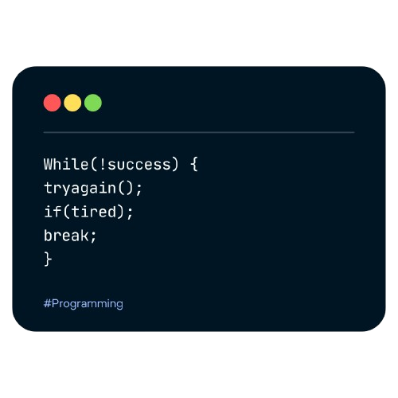

    <h1>Hi 👋, I'm Ibad Hussain</h1>
    <h3>Innovative Full Stack Developer with a Problem-Solving Mindset</h3>

Hello, I’m Ibad Hussain, a passionate Full Stack Developer with a strong focus on the MERN stack (MongoDB, ExpressJS, ReactJS, NodeJS). I’m currently pursuing a Bachelor's degree in Computer Science at the University of Karachi, where I’m honing my skills in both frontend and backend development.

<h3 align="left">Connect with me</h3>

<h3 align="left">Languages and Tools</h3>

          

