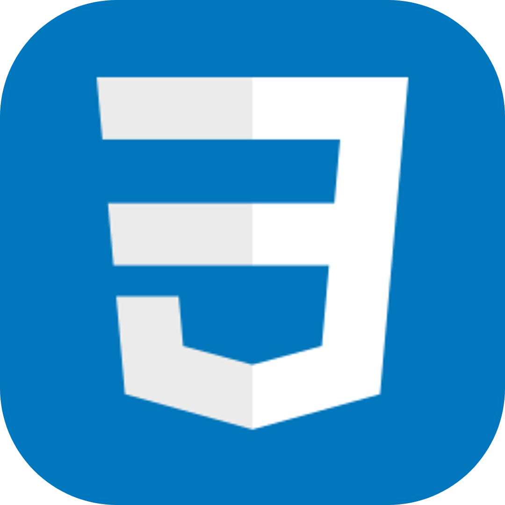
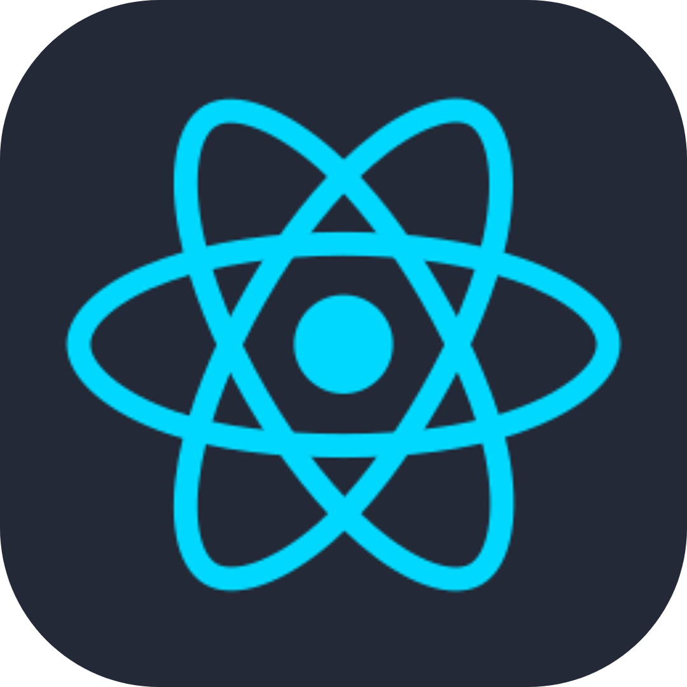
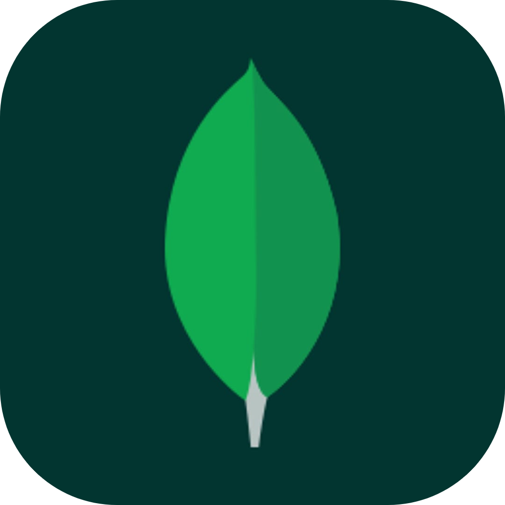
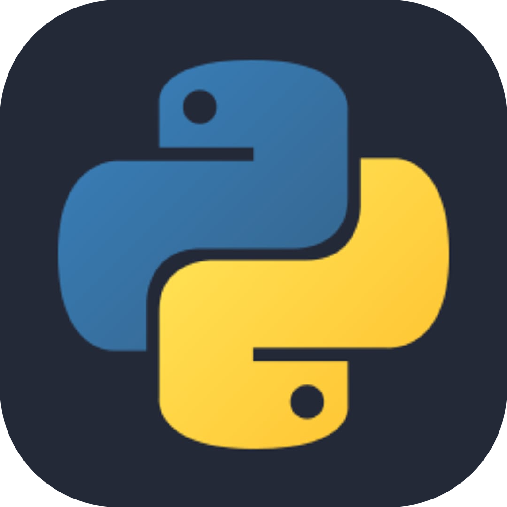

<h2 align="center">Ibad Hussain: A Full Stack Developer with a Problem-Solving Mindset</h2>

<h4>Hello, I’m Ibad Hussain, a passionate Full Stack Developer with a strong focus on the MERN stack (MongoDB, ExpressJS, ReactJS, NodeJS). I’m currently pursuing a Bachelor's degree in Computer Science at the University of Karachi, where I’m honing my skills in both frontend and backend development.</h4>

 

## Languages and Tools

    &nbsp;
    &nbsp;
    &nbsp;
    &nbsp;
    &nbsp;
    &nbsp;
    &nbsp;
    &nbsp;
    &nbsp;
    

 

## Connect with me

    
    
    

 

## Profile Stats

    &nbsp;
    

